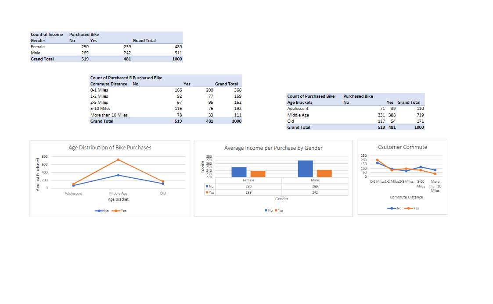
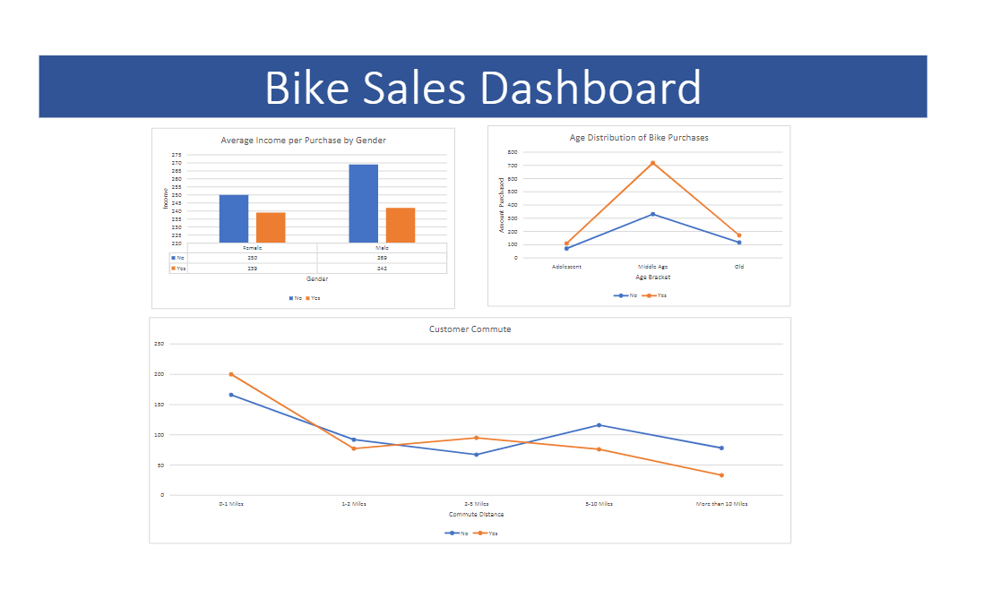

# Bike Sale Excel Workbook and Dashboard

In this mini-project, I have worked on data cleaning and analysis of a dataset related to bike purchases. The dataset includes various demographic and personal details of the customers. Below is an outline of the key steps and methodologies I employed in this project.

## Dataset Overview
The raw CSV data was based on multiple attributes including:
- **Marital status**
- **Gender**
- **Income**
- **Children**
- **Education**
- **Occupation**
- **Homeowner status**
- **Car count**
- **Commute distance**
- **Region**
- **Age**

## Data Cleaning Operations
To enhance the quality and usability of the data, I undertook the following cleaning operations:

1. **Search and Replace Ambiguous Values**
   - Resolved ambiguities in the representation of values. 
   - Example: Replaced 'M' which stood for both 'Male' in the Gender column and 'Married' in the Marital Status column with clear and distinct identifiers.

2. **Conditional Column Creation**
   - Implemented *conditional column creation* using the formula:
     ```
     =IF(L2>55, "Old", IF(L2>=31, "Middle Age", IF(L2<31, "Adolescent", "Invalid")))
     ```
   - This formula was used to categorize each individual's age into specific age ranges: "Old", "Middle Age", "Adolescent", or "Invalid".
   - Purpose: To streamline age-related analysis in pivot tables.

## Resulting Enhancements
- The data is now more structured and easier to analyze.
- Ambiguities in the dataset have been resolved, leading to clearer insights.
- Age categorization facilitates more effective demographic analysis in pivot tables.

## Workbook Structure


In the workbook, there is a:
- raw-data sheet
- woking-sheet with all the finals data-cleaning changes
- a sheet with the pivot tables
- a dashboard

## Pivot Tables


## Dashboard

